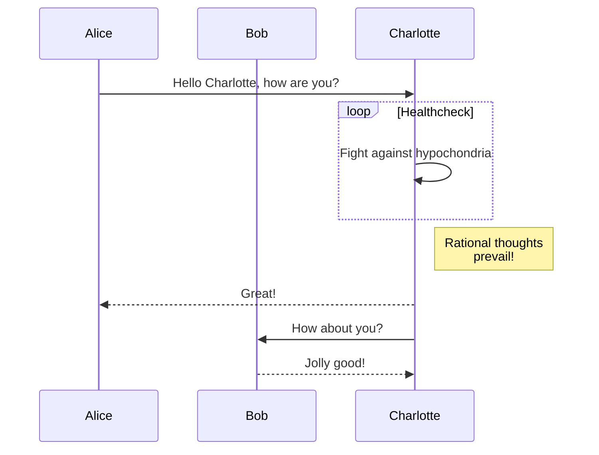
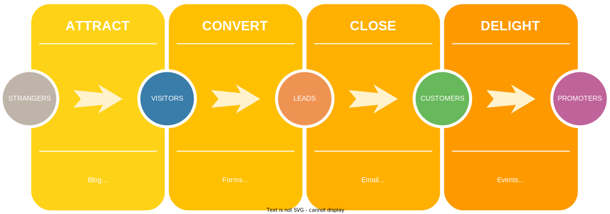

# Disclaimers, Notices, and License Terms

THIS SPECIFICATION IS PROVIDED "AS IS" WITH NO WARRANTIES WHATSOEVER, INCLUDING
ANY WARRANTY OF MERCHANTABILITY, NONINFRINGEMENT, FITNESS FOR ANY PARTICULAR
PURPOSE, OR ANY WARRANTY OTHERWISE ARISING OUT OF ANY PROPOSAL, SPECIFICATION OR
SAMPLE.

Without limitation, TCG disclaims all liability, including liability for
infringement of any proprietary rights, relating to use of information in this
specification and to the implementation of this specification, and TCG disclaims
all liability for cost of procurement of substitute goods or services, lost
profits, loss of use, loss of data or any incidental, consequential, direct,
indirect, or special damages, whether under contract, tort, warranty or
otherwise, arising in any way out of use or reliance upon this specification or
any information herein.

This document is copyrighted by Trusted Computing Group (TCG), and no license,
express or implied, is granted herein other than as follows: You may not copy or
reproduce the document or distribute it to others without written permission
from TCG, except that you may freely do so for the purposes of (a) examining or
implementing TCG specifications or (b) developing, testing, or promoting
information technology standards and best practices, so long as you distribute
the document with these disclaimers, notices, and license terms.

Contact the Trusted Computing Group at www.trustedcomputinggroup.org for
information on specification licensing through membership agreements.

Any marks and brands contained herein are the property of their respective
owners.

---

# Change History

| **Revision** | **Date**   | **Description** |
| ------------ | ---------- | --------------- |
| 0.1/1        | 2022/09/17 | Initial draft   |

---

# Document Style

**Key Words**

The key words "MUST," "MUST NOT," "REQUIRED," "SHALL," "SHALL NOT," "SHOULD,"
"SHOULD NOT," "RECOMMENDED," "MAY," and "OPTIONAL" in this document's normative
statements are to be interpreted as described in
[RFC 2119: Key words for use in RFCs to Indicate Requirement Levels](https://www.ietf.org/rfc/rfc2119.txt).

**Statement Type**

Please note an important distinction between different sections of text
throughout this document. There are two distinctive kinds of text: _informative
comments_ and _normative statements_. Because most of the text in this
specification will be of the kind _normative statements_, the authors have
informally defined it as the default and, as such, have specifically called out
text of the kind _informative comment_. They have done this by flagging the
beginning and end of each informative comment and highlighting its text in gray.
This means that unless text is specifically marked as of the kind _informative
comment_, it can be considered a _normative statement_.

EXAMPLE:

> This is the first paragraph of 1–n paragraphs containing text of the kind
> informative comment ...
>
> This is the second paragraph of text of the kind informative comment ...
>
> This is the nth paragraph of text of the kind informative comment ...
>
> To understand the TCG specification, the user must read the specification.
> (This use of MUST does not require any action).

---

\tableofcontents

\listoffigures

\listoftables

---

# Great Section



> Don't worry, rational thoughts will prevail!

```python
# This program prints Hello, world!

print('Hello, world!')
```

WYSIWYG
=======

<!-- created with local install of https://app.diagrams.net/ -->

